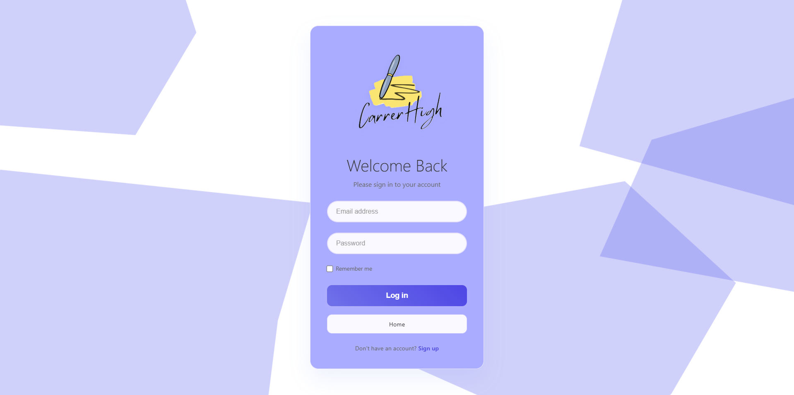

# <h1 align = "center"> CarrerHigh </h1>

## <h2 align = "center">Career Roadmap Management </h2>
 

<i>Course Code: CSE370</i>

  

> A lightweight, student-first web app to plan your career roadmap, track tasks, manage research ideas, and collaborate with mentors—built with just **HTML, CSS, JS, PHP, and MySQL**.

---

## ✨ Overview

**CarrerHigh** helps students (and mentors) organize career goals, break them into actionable tasks, track exams & documents, and find collaborators for research—without extra frameworks or services.

- 🗺️ Roadmaps & tasks (create, update, delete)  
- 📚 Research idea vault & collaboration  
- 📝 Document & exam tracking with alarm/reminders (read-side)  
- 👥 Mentor tools for editing roadmaps & collaborations  
- 🛠️ Admin tools for role management & mentorship approval  

---

## 📦 Tech Stack

- **Frontend:** HTML, CSS, JavaScript  
- **Backend:** PHP  
- **Database:** MySQL   

---

## 🧩 Feature Matrix

| Sl | Feature Name                                   | Type  | Notes |
|----|------------------------------------------------|---------------------------------------------------|-------|
| 1  | User Handling: Login & Signup                  | —                                                 | Authentication (session-based). |
| 2  | Roadmap & Tasks                                | Create, Update                                    | Roadmap sections, milestones, deadlines. |
| 3  | Delete Tasks                                   | Delete                                            | Remove completed/unwanted tasks. |
| 4  | Research Ideas                                 | Create, Update                                    | Title, domain/tags, abstract/notes. |
| 5  | Delete Research Ideas                          | Delete                                            | Remove outdated ideas. |
| 6  | Document Tracking `{completed, pending}`       | Create, Update                                    | Upload/URL, status toggle. |
| 7  | Exam Tracking `{completed(name, result), pending(name, date)}` | Create, Update                     | Store outcomes and schedules. |
| 8  | Exam Date Alarm                                | Read                                              | Read-side alerts from stored dates. |
| 9  | Co-curricular Activities Store                 | Create, Read                                      | Log events, roles, certificates. |
| 10 | Research Collaboration `{Creator Post, Filtration, Collab}` | Create, Read, Update                 | Post openings, filter by skill, manage requests. |

---

## 👨‍🏫 Mentor’s Perspective

| Sl | Feature                | Type | Notes |
|----|------------------------|---------------------------------------------------|-------|
| 01 | Roadmap Edit           | Update, Delete                                    | Mentor can refine or remove student roadmap parts. |
| 02 | Collaboration          | Create, Read, Update                              | Post/curate collaborations; update statuses. |

---

## 🛡️ Admin

| Sl | Feature            | Type  | Notes |
|----|--------------------|---------------------------------------------------|-------|
| 01 | Role Management    | Update                                            | Promote/demote roles (Student/Mentor/Admin). |
| 02 | Approve Mentorship | Update                                            | Approve mentor status & links to students. |

---

## 👥 Team

- [**Abdullah Al Mazid Zomader**](https://github.com/mazidzomader)  
- [**Masrur Sarar**](https://github.com/ConquerCommand)  
- [**Sahela Khan Retu**](https://github.com/Sahela-Khan)  

---

## 📸 Screenshots

